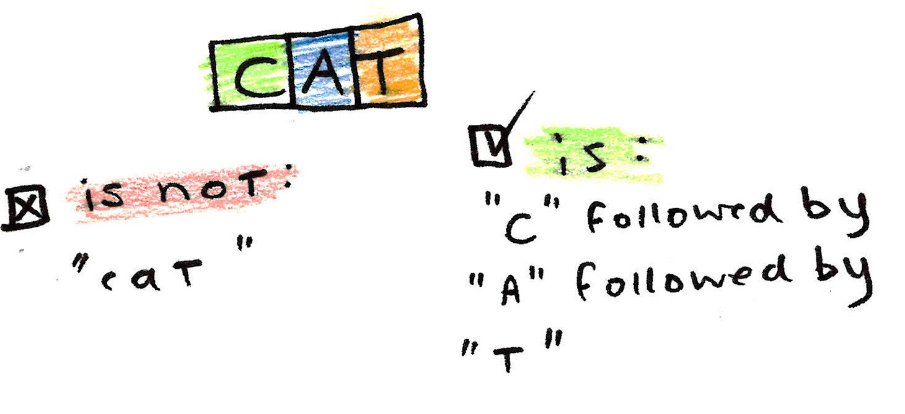

# First Assignment - RegEx

Enough of Algorithms! Let's start with a practical development tool called "RegEx".

What is *RegEx*? It's a short form of "Regular Expressions". We use them to detect or validate something in string type while trying to find some substring with desired format.

> Imagine developing a website and designing the sign-up page. You sure want to check if the email entered by user is valid or not. What about the password?
Trying to find all sentences which include swearings or some special info through the traffic of your server?

We can do all of them by RegEx. This tool was created to save time for devs and performance for computers not doing all that stuff by conditions. So I think we can call the useful.

<br />
<div align="center">
    
</div>

## Getting Started

After all the advertising, what should we do?
The path is clear and like the two previous parts, and you should start by searching about regex to learn formats. Then, complete the code with the description in them and pass all the tests in ```test\java``` folder. Then, add your mentor as a *Collaborator* to let them grade you.

Notes:

- Every method in **Exercises.java** has a different return type, so be careful about your implementation
- Some details about syntax of RegEx in every engine are different, so learn about Java's regex

## Resources

- [How to work with RegEx in Java](https://www.geeksforgeeks.org/regular-expressions-in-java/)

- [Regex cheat-sheat](https://www.rexegg.com/regex-quickstart.php)

- [RegEx course (Jadi)](https://youtu.be/m2zlSAsePNg?si=ZXdW0eJjCkP5KlWk)

<br />
Good luck and happy coding!
